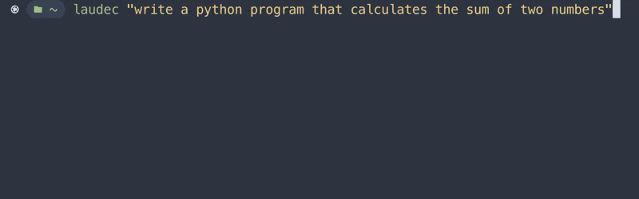

# laudec



laudec is a wrapper around the interactive Claude Code TUI. It takes a prompt,
runs `claude` in the background, and prints the answer, so Claude can be used
from a script or a pipe.

It runs a normal `claude` session in a pseudo-terminal. A `Stop` hook fires when
Claude finishes its turn, captures the final message, and laudec prints it.
Tools are disabled by default, so Claude acts as a text responder. laudec is a
single Python file with no dependencies.

## Requirements

- `python3`
- The `claude` CLI, logged in.

## Install

Clone into a local data directory and symlink the launcher onto your `PATH`:

```bash
git clone https://github.com/seb3point0/laudec.git ~/.local/share/laudec
ln -s ~/.local/share/laudec/laudec ~/.local/bin/laudec
```

Make sure `~/.local/bin` is on your `PATH`, then run `laudec` from anywhere.
Update with:

```bash
git -C ~/.local/share/laudec pull
```

The script can also be run directly with `python3 laudec.py "..."`.

## Usage

```bash
laudec "what is 17 * 23?"
laudec -m sonnet "quick question"
echo "some data" | laudec "summarize this"
git diff | laudec "review this diff"
```

Input piped on stdin is appended to the prompt.

## Options

### Flags

| Flag | Description |
|---|---|
| `-m, --model <name>` | Model to use, e.g. `sonnet`, `opus`, `haiku`. |
| `--effort <level>` | Effort level: `low`, `medium`, `high`, `xhigh`, `max`. |
| `-b, --bypass` | Skip laudec and run `claude -p` directly. |
| `-v, --verbose` | Print diagnostics to stderr. |

### Environment variables

| Variable | Default | Description |
|---|---|---|
| `LAUDEC_CMD` | `claude` | The binary to run. |
| `LAUDEC_MODEL` | `sonnet` | Model, same as `-m`. |
| `LAUDEC_EFFORT` | `medium` | Effort level, same as `--effort`. |
| `LAUDEC_FAST` | `1` | Trim TUI startup. Set `0` to keep MCP servers and skills. |
| `LAUDEC_TOOLS` | `""` | The `--tools` value. Empty disables all tools. Set `default` to allow tools, and add `--dangerously-skip-permissions` via `LAUDEC_ARGS`. |
| `LAUDEC_ARGS` | none | Extra arguments passed through to `claude`. |
| `LAUDEC_HOOK_CMD` | auto | Override the Stop-hook command laudec registers. |
| `LAUDEC_BOOT_TIMEOUT` | `30` | Seconds to wait for Claude to start. |
| `LAUDEC_TIMEOUT` | `300` | Overall time limit, in seconds. |
| `LAUDEC_RUNTIME_DIR` | `$XDG_RUNTIME_DIR` or `/tmp` | Where the named pipes are created. |
| `LAUDEC_NO_ARGPROMPT` | `0` | Set `1` to type the prompt into the TUI instead of passing it as an argument. |

### Exit codes

`0` success, `2` Claude did not start, `3` no response, `4` delivery error.

## OpenAI-compatible API server

`laudec serve` starts an HTTP server, standard library only, that exposes laudec
behind the OpenAI API. Any client that speaks `/v1/chat/completions` can use it.
It serves three models, `haiku`, `sonnet`, and `opus`, each also available at
every effort level, and answers each request by running laudec.

```bash
laudec serve                             # listens on 127.0.0.1:8787
laudec serve --port 9000 --api-key KEY   # custom port, gated by a bearer token
```

`laudec serve` and `python3 laudec_serve.py` are equivalent and take the same
flags.

Example request:

```bash
curl http://127.0.0.1:8787/v1/chat/completions \
  -H 'Content-Type: application/json' \
  -d '{"model":"sonnet","messages":[{"role":"user","content":"hello"}]}'
```

### Client configuration

- Base URL: `http://127.0.0.1:8787/v1`
- Model: `haiku`, `sonnet`, or `opus`, optionally suffixed with an effort level
  such as `opus-high` or `sonnet-max`.
- API key: any non-empty string. laudec authenticates to Claude through the
  logged-in Claude Code, so the server needs no key of its own. Set `--api-key`
  to require a bearer token on the endpoint.

### Models and effort

`GET /v1/models` lists every model and every model/effort combination, from
`opus-low` to `opus-max`, so a client with only a model selector can choose the
effort there. The effort can also be set with the OpenAI `reasoning_effort`
field (`low`, `medium`, `high`, `xhigh`, `max`), which overrides any suffix.

### Endpoints

- `POST /v1/chat/completions`, streaming and non-streaming
- `GET /v1/models`
- `GET /health`

Sampling parameters such as `temperature` and `max_tokens` are accepted and
ignored. Token counts in `usage` are estimates. Streaming delivers the whole
answer in a single chunk, since laudec produces the full reply at the end.

### Function calling

The server accepts the OpenAI `tools` field and returns structured `tool_calls`
with `finish_reason` set to `tool_calls`, for both streaming and non-streaming
requests. `tool_choice` (`auto`, `none`, `required`, or a named function) is
honored. Prior `tool_calls` and `tool` results in the message history are
preserved, so multi-turn tool loops keep their context.

Claude does not execute anything. It emits the call as text, the client runs the
tool, and the result is returned on the next request, the same as with a real
OpenAI endpoint. The text-only execution model is unchanged.

#### How it works

Claude runs with tools disabled and can only produce text, so the server bridges
OpenAI tool calls over that text channel in three steps:

1. Inject. The `tools` schemas are rendered into a system instruction that
   defines a strict format. To call tools, the model replies with only a fenced
   `tool_call` code block holding a JSON array of `{"name", "arguments"}`
   objects, then stops.
2. Run. laudec drives the TUI and captures the text reply.
3. Parse. The server extracts the calls from that text, rebuilds them as OpenAI
   `tool_calls`, and sets `finish_reason` to `tool_calls`. Tool results from
   later turns are folded back into the prompt as context.

The parser accepts three reply formats: the fenced `tool_call` block, Claude's
native `<function_calls>` XML, and a bare JSON array. It validates call names
against the tools in the request, so an unrelated JSON block in a normal answer
is not treated as a call. Arguments are normalized to a valid JSON string. Only
the leading call or calls are kept; a fabricated result written after a call is
discarded.

#### Limitations

The bridge depends on the model emitting parseable text, so it is best effort
rather than enforced:

- Arguments are not validated against the tool schema. Unparseable arguments are
  replaced with `{}`.
- `tool_choice: required` and a named function are instructions to the model,
  not hard constraints.
- A call the parser cannot recognize is returned as plain message content for
  that turn instead of a structured call.

A native API enforces tool calls at the protocol level and cannot produce a
malformed call. laudec cannot, because it fronts the interactive Claude
subscription through the TUI, where native tool use is not available. Calling the
API directly would bill against API credits.

To have Claude run tools itself, its own `bash`, `read`, `edit`, web, and so on,
executed locally in the TUI, rather than returning calls to the client, set
`LAUDEC_TOOLS=default`. See [Security](#security). That mode does not combine
with this bridge.

### Server options

| Variable / flag | Default | Description |
|---|---|---|
| `--host` / `LAUDEC_SERVE_HOST` | `127.0.0.1` | Bind address. |
| `--port` / `LAUDEC_SERVE_PORT` | `8787` | Bind port. |
| `--api-key` / `LAUDEC_SERVE_API_KEY` | none | Bearer token to gate the endpoint. |
| `LAUDEC_SERVE_CONCURRENCY` | `2` | Max parallel laudec calls. The rest queue. |
| `--timeout` / `LAUDEC_SERVE_TIMEOUT` | `300` | Per-request seconds. |
| `LAUDEC_BIN` | this dir's `laudec.py` | How to invoke laudec. |

## Security

By default laudec disables Claude's tools (`--tools ""`), so Claude produces text
only.

Setting `LAUDEC_TOOLS=default` lets Claude use its tools again, including running
shell commands, editing files, and reading the disk. Use it only with prompts
and input you trust, and add `--dangerously-skip-permissions` via `LAUDEC_ARGS`,
since the TUI is non-interactive and a permission prompt would otherwise hang.

The API server fronts your Claude subscription and binds to `127.0.0.1` by
default. Expose it more widely only behind an API key and your own network
controls.

## Notes

- Each call is a fresh session, with no memory between runs.
- Startup takes a few seconds per call while the TUI boots. `sonnet` and `haiku`
  are fastest.
- The full response arrives at once.
